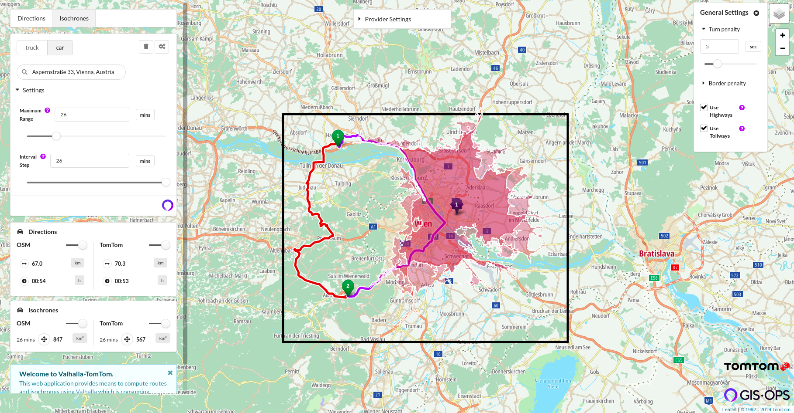

# GIS • OPS OSM Street Data Converter Demo

This repository lets you run a ReactJS app for routing & navigation using the open-source [Valhalla routing engine](https://github.com/valhalla/valhalla) and allowing you to compare the road networks of **OpenStreetMap, TomTom & HERE**.

We offer commercial services to convert any proprietary data sources, e.g. TomTom and HERE, to the OSM data model to leverage the vast landscape of OSM-based tools and software. See more details at https://gis-ops.com/routing-and-optimisation/#data-services or contact us on enquiry@gis-ops.com in case of questions or interest.



---

This repository holds everything necessary to replicate our demo ReactJS web app located at https://converter.gis-ops.com on your local computer, including:

- `docker-compose.yml` to run the web app and 3 instances of [Valhalla](https://github.com/valhalla/valhalla), one for each data source (OSM, TomTom, HERE)
- Valhalla example road graphs for TomTom, HERE and OSM

After the quick setup below you'll be able to view the web app on `http://localhost:3000` in your browser.

## Setup

### Requirements

The following software must be available:

- Docker
- docker-compose

This demo works on

- **Windows**: Follow [these Microsoft instructions](https://docs.microsoft.com/en-us/virtualization/windowscontainers/deploy-containers/linux-containers) to install Docker and run Linux containers
- **Mac OS**: There are workable instructions on the official site to install [Docker](https://docs.docker.com/docker-for-mac/)
- **Linux**:
```bash
sudo apt-get install docker.io
sudo systemctl start docker
sudo systemctl enable docker
```

`docker-compose` can be installed following the instructions on [docker.com](https://docs.docker.com/compose/install/).

### Installation

1. Download the ZIP archive of this repository (or alternatively clone via `git`)
2. Unzip the repository to your preferred location
3. `docker-compose up -d` to pull & start all containers
4. Wait until the Docker images were pulled and the containers were started
5. Visit `http://localhost:3000` in your browser and **enjoy** :smile:

## Usage

The demo app is a showcase for our commercial service to **convert any arbitrary street data source into OpenStreetMap's data model**.

Using the app you can:

- calulate routes and isochrones for **car or truck** profiles in the region of Vienna, Austria (TomTom) or Ramsey County, MN (HERE)
- fully customize your profile with a variety of different weights and restrictions, including:
    - truck **weight, height, width, length, axle load and hazardous materials**
    - avoid highways or tollways
    - penalize turns or border crossings
- the app will always compare the results using OSM data and:
    - either TomTom
    - or HERE data
- view and compare active restrictions for both active data providers

## Data

The datasets provided out of the box in this repository are different for each provider and indicated by the black bounding box in the web app:

- **TomTom**: Linz, Austria
- **HERE**: Ramsey County, MN, USA

The following data sources are available:

- [**OpenStreetMap (OSM)**](https://openstreetmap.org): The world's largest crowd-sourced database of physical objects founded by Steve Coast in 2004. It's also the foundation for a huge universe of open-source and free software, ranging from analytical applications to map rendering and routing applications.
- [**TomTom**](https://www.tomtom.com/products/real-time-map-data/): The world’s biggest tech companies – including Apple, Uber and Tesla – choose TomTom Real-Time Map Data to provide context and coverage for drivers in over 200 countries.
- [**HERE**](https://www.here.com/products/mapping/map-data): HERE Map Data has been at the forefront of mapping innovations for decades, serving automotive OEMs, businesses and governments that require the most accurate location intelligence.
